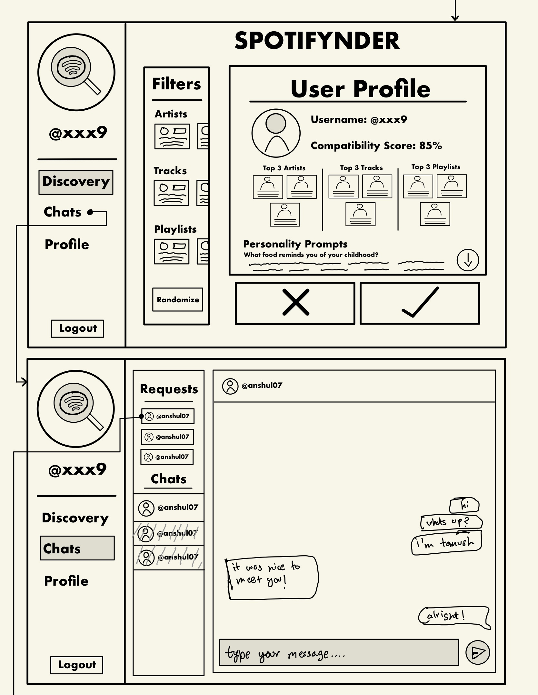

# UI Diagrams

## **Onboarding Feature Part 1: Spotify Login and Artist/Track Selection**

The **Spotify Login and Artist/Track Selection Screen** is the first step in the onboarding process. The layout allows users to easily log in using their Spotify credentials and select their favorite artists and tracks, which will be used to personalize their experience on Spotifynder.

### Key Interactions:

1. **Spotify Login Button**: This prominent button allows users to authenticate their Spotify account quickly. Once logged in, Spotifynder will pull data from the user’s Spotify profile.
2. **Artist/Track Selection**: After logging in, users are presented with a list of their top artists and tracks retrieved from Spotify. They can select their favorites using checkboxes, allowing Spotifynder to create more relevant matches based on musical preferences.
3. **Next Button**: After selecting their top artists and tracks, users click "Next" to proceed to the second part of onboarding.

**Use Case**:  
A new user logs into Spotifynder with their Spotify account, selects their favorite artists and tracks, and moves to the next onboarding stage. This information helps the system match them with others based on shared music tastes.

---

## **Onboarding Feature Part 2: Playlist Integration and Profile Questions**

The **Playlist Integration and Profile Questions Screen** completes the onboarding process by allowing users to add personal Spotify playlists and answer unique profile questions that give depth to their profile.

### Key Interactions:

1. **Playlist Selection**: Users can select personal playlists from their Spotify account to add to their profile. This helps personalize their profile and makes it easier for Spotifynder to match them with users who share similar music tastes.
2. **Profile Questions**: Below the playlist selection, users answer multiple questions about their music preferences and personal interests. This information further customizes their profile.
3. **Finish Button**: Once they have added their playlists and answered the questions, users click the “Finish” button to complete the onboarding process.

**Use Case**:  
A user selects their personal playlists to showcase their music taste, answers profile questions, and completes their onboarding. This enables Spotifynder to build a detailed and personalized user profile for better matchmaking.

---

## **Discovery Page Feature: Filters by College, Artists, and Playlists**

The **Discovery Page** allows users to explore potential matches by applying filters such as college, favorite artists, and playlists, making the experience more tailored and personalized.

### Key Interactions:

1. **Filter Options**: At the top of the screen, users can apply filters such as "By College," "By Artist," or "By Playlist." This allows them to narrow down potential matches based on specific criteria.
2. **Profile Cards**: Users will scroll through profile cards that display a potential match's name, profile picture, top artists, playlists, and college affiliation.
3. **Like/Skip Buttons**: Each profile card includes “Like” and “Skip” buttons, allowing users to express interest or move on to the next profile.

**Use Case**:  
A user filters potential matches by selecting the "By College" filter. They scroll through a list of profiles, checking out users from their own university and liking or skipping profiles based on their preferences.

---

## **Chat Feature: Conversations with Matches**

The **Chat Screen** is where users can message their matches, fostering connections through conversations about their shared interests and music preferences.

### Key Interactions:

1. **Match List**: On the left side, users see a list of all their matches. They can click on any match to start chatting.
2. **Chat Window**: The chat window displays messages exchanged with a selected match. Users can type messages in a text field and click the "Send" button to communicate.
3. **Profile Access**: At the top of the chat window, users can view their match’s profile for a quick reminder of their music preferences and other information.

**Use Case**:  
After matching with someone, a user opens the chat to start a conversation about their favorite shared artist. The user sends messages back and forth, building a connection based on mutual interests.

---
