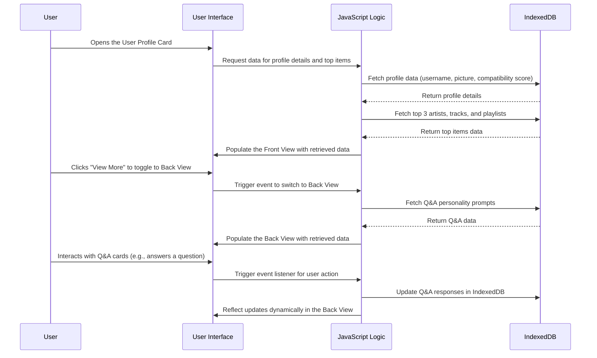

# Feature Sequence Diagram: User Profile Card Component (Front and Back Views)

## Feature Description
The User Profile Card Component provides detailed user information through two interactive views:
1. **Front View**:
   - Displays the user's profile picture, username, compatibility score, and top 3 artists, tracks, and playlists.
   - Data is fetched dynamically from IndexedDB and reflects any updates from filter changes or interactions.
2. **Back View**:
   - Displays personality prompts with Q&A cards.
   - Dynamically updates to show data persisted in IndexedDB.

### Key Components:
1. **IndexedDB**:
   - Stores user profile data (profile picture, username, compatibility score, top 3 artists, tracks, playlists, and personality Q&A).
   - Updates dynamically based on user interactions.
2. **JavaScript Logic**:
   - Retrieves and updates data from IndexedDB.
   - Toggles between front and back views of the profile card.
3. **User Interface (UI)**:
   - Displays dynamically fetched and updated profile details and Q&A cards.

## Sequence Diagram

