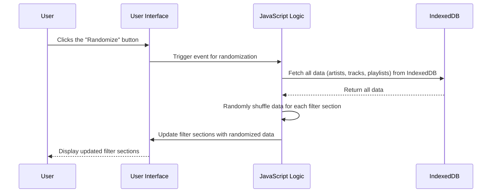

# Feature Sequence Diagram: Randomize Button

## Feature Description
The **Randomize Button** provides a dynamic shuffling feature for filters:
- Randomly selects and displays items (artists, tracks, playlists) from IndexedDB.
- Updates the UI with the new randomized selections.
- Encourages users to explore new content and experiment with different filters.

### Key Components:
1. **IndexedDB**:
   - Stores data for artists, tracks, and playlists.
2. **JavaScript Logic**:
   - Fetches data from IndexedDB.
   - Randomly selects and updates the filter sections.
3. **User Interface (UI)**:
   - Dynamically updates to reflect the randomized filters.

## Sequence Diagram

