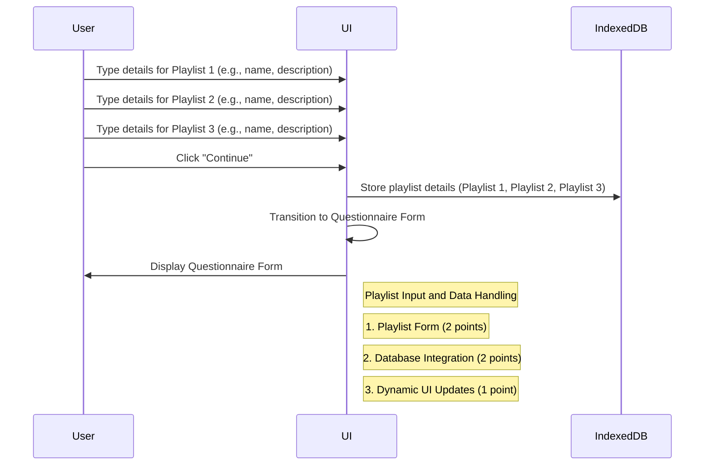

```mermaid
sequenceDiagram
    participant User
    participant UI
    participant IndexedDB

    User->>UI: Type details for Playlist 1 (e.g., name, description)
    User->>UI: Type details for Playlist 2 (e.g., name, description)
    User->>UI: Type details for Playlist 3 (e.g., name, description)
   
    User->>UI: Click "Continue"
    
    UI->>IndexedDB: Store playlist details (Playlist 1, Playlist 2, Playlist 3)
    
    UI->>UI: Transition to Questionnaire Form
    UI->>User: Display Questionnaire Form
    
    Note right of UI: Playlist Input and Data Handling
    Note right of UI: 1. Playlist Form (2 points)
    Note right of UI: 2. Database Integration (2 points)
    Note right of UI: 3. Dynamic UI Updates (1 point)
```