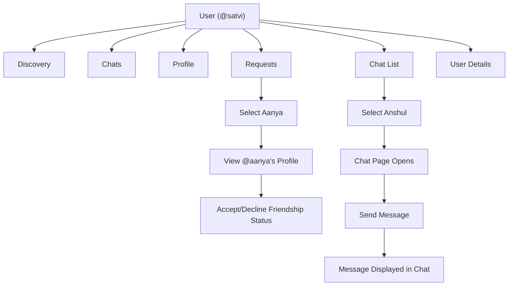

```mermaid
graph TD;
    User["User (@satvi)"] --> Discovery;
    User --> Chats;
    User --> Profile;
    User --> Requests;
    User --> ChatList["Chat List"];
    User --> UserDetails["User Details"];
    
    Requests --> SelectAanya["Select Aanya"];
    SelectAanya --> ViewAanyaProfile["View @aanya's Profile"];
    ViewAanyaProfile --> FriendshipStatus["Accept/Decline Friendship Status"];
    
    ChatList --> SelectAnshul["Select Anshul"];
    SelectAnshul --> ChatPage["Chat Page Opens"];
    ChatPage --> SendMessage["Send Message"];
    SendMessage --> MessageDisplayed["Message Displayed in Chat"];
```