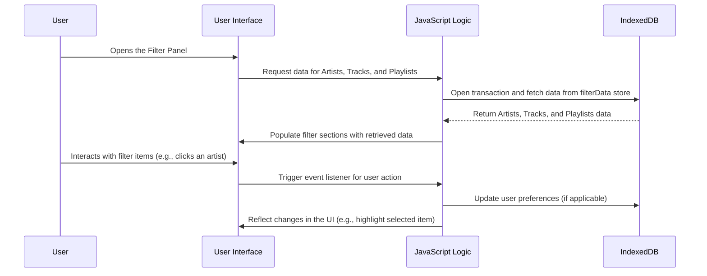

# Feature Sequence Diagram: Filter Panel with IndexedDB Integration

## Feature Description
This feature implements a dynamic filter panel that fetches and displays data for artists, tracks, and playlists from IndexedDB. The user can interact with the panel to view the available options. The panel dynamically updates based on the IndexedDB data, ensuring real-time synchronization between the database and the UI.

### Key Components:
1. **IndexedDB**:
   - Stores filter data (artists, tracks, playlists).
   - Fetches the stored data dynamically.
2. **JavaScript Logic**:
   - Retrieves data from IndexedDB using transactions.
   - Updates the DOM with fetched data.
3. **User Interface (UI)**:
   - Displays filter sections for Artists, Tracks, and Playlists.
   - Updates dynamically without page reloads.

## Sequence Diagram

